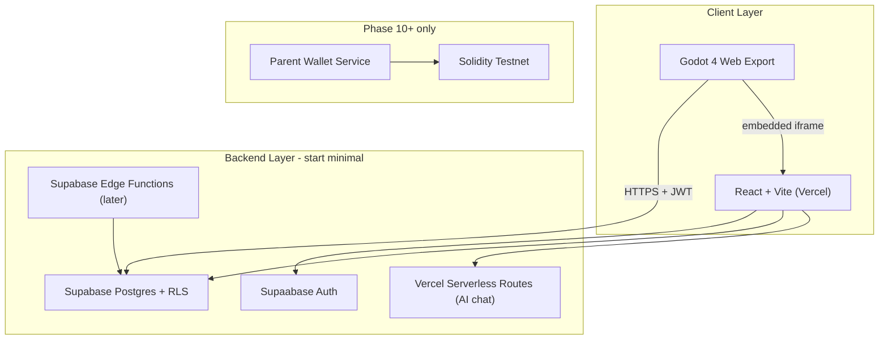
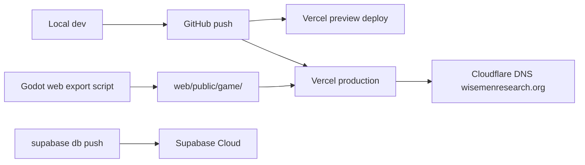

# RemiWorld / WiseMen Research — 10-Phase Development Plan

---

## Repo Analysis

**Current state:** [RemiWorld](/Users/jl/RemiWorld) is a mature **Godot-only, offline-first** 2D game prototype — not a monorepo yet.

| Area | Status | Key paths |
|------|--------|-----------|
| Game engine | Godot 4.6, GDScript, GL Compatibility | [`project.godot`](/Users/jl/RemiWorld/project.godot) |
| Game content | 6 levels, 14 NPCs, 8 missions, 7 mini-games | [`scenes/`](/Users/jl/RemiWorld/scenes/), [`scripts/data/MissionDatabase.gd`](/Users/jl/RemiWorld/scripts/data/MissionDatabase.gd) |
| Economy | Local VIBE tokens, XP, NFT-like badges | [`autoload/GameState.gd`](/Users/jl/RemiWorld/autoload/GameState.gd), [`autoload/InventoryManager.gd`](/Users/jl/RemiWorld/autoload/InventoryManager.gd) |
| Persistence | JSON save at `user://remiworld_save.json` | [`autoload/SaveManager.gd`](/Users/jl/RemiWorld/autoload/SaveManager.gd) |
| Save format | `to_dict()` / `from_dict()` on 4 managers | GameState, Inventory, Missions, Avatar |
| Web app | **None** | — |
| Supabase / auth | **None** (draft schema in docs only) | [`docs/blockchain_future.md`](/Users/jl/RemiWorld/docs/blockchain_future.md) |
| Deployment | **None** (no export presets, no CI) | — |
| AI chat | Scripted dialogue only | [`scripts/ui/DialogueBox.gd`](/Users/jl/RemiWorld/scripts/ui/DialogueBox.gd) |
| Trading | In-game wager only; `tradeable: false` on NFTs | [`scripts/ui/challenges/DaisyDogFightPanel.gd`](/Users/jl/RemiWorld/scripts/ui/challenges/DaisyDogFightPanel.gd) |
| Blockchain | Planning doc only | [`docs/blockchain_future.md`](/Users/jl/RemiWorld/docs/blockchain_future.md) |

**Strengths to leverage:**
- Rich vertical slice already playable in Godot
- Clean save serialization (`SaveManager` already aggregates manager dicts)
- Economy and inventory models map directly to future DB tables
- Existing v4.0 vision doc aligns with phased backend approach

**Gaps to close (in order):**
1. Deployable web shell
2. Godot Web export pipeline
3. Supabase auth + cloud saves
4. Web pages beyond the game
5. DB-backed tokens/inventory/trading
6. Social layer (async, not live multiplayer)
7. AI chat
8. Blockchain (last)

**Your decisions (locked in):**
- **Account model:** Simple single account per player (email/password or magic link)
- **Repo structure:** Keep Godot at repo root; add `web/` alongside — refactor to full monorepo later if needed

---

## Recommended Architecture

**Recommendation: flat repo now, monorepo later.** Your preference is correct — no strong reason to split repos. Godot and web share docs, schema, and deploy artifacts. Submodules add friction with no benefit at this scale.



**Stack choices (recommended path):**

| Layer | Tool | Why |
|-------|------|-----|
| Web frontend | React + Vite + TypeScript | Fast dev, Vercel-native, huge ecosystem |
| Hosting | Vercel | You already use it; preview deploys per PR |
| DNS | Cloudflare | wisemenresearch.org |
| Auth + DB | Supabase | You already use it; auth + Postgres + Realtime in one |
| Game API | Supabase client from Godot (HTTPRequest) + RLS | Avoid FastAPI until you hit a real limit |
| AI chat | Vercel serverless route + OpenAI/Anthropic API | No separate Python server for v1 |
| Game hosting | Static export inside `web/public/game/` at `/game` | Simpler than subdomain; upgrade to `game.wisemenresearch.org` later |
| Blockchain | Solidity in `contracts/` folder, Phase 10 only | Explicitly deferred |

**What we deliberately skip early:**
- FastAPI backend (add only if Edge Functions + Vercel routes are insufficient)
- Live multiplayer / WebSockets game sync
- Real wallet connect / MetaMask
- RAG / vector search (Phase 9b, after basic chat works)
- Parent-child accounts (add in Phase 8+ if needed)

**Tradeoffs:**

| Choice | Pro | Con |
|--------|-----|-----|
| `/game` path vs subdomain | One Vercel project, shared cookies for auth | Large Godot WASM bundle on same origin |
| Supabase direct from Godot | Simple, no middleware | Must design RLS carefully; JWT in browser export |
| Flat repo vs monorepo | Zero migration pain now | Slightly messier at scale; refactor in Phase 6+ |
| Async trading vs live | Much easier, fits Supabase | Not "real-time MMO" feel |

---

## 10-Phase Development Plan

### Phase 1 — Deployable Web Shell
**Goal:** Something live at wisemenresearch.org before any backend.

**What we build:**
- `web/` React + Vite + TypeScript app
- Pages: Home, About/Research (stub), Play (placeholder)
- Shared layout, nav, basic branding
- Vercel project + Cloudflare DNS

**Files/folders:** `web/`, `web/src/pages/`, `vercel.json`, root `README.md` update

**Tools:** React, Vite, TypeScript, Vercel CLI, Cloudflare DNS

**Difficulty:** Easy

**Risks:** DNS propagation delay; Vercel domain config mistakes

**Done when:** `wisemenresearch.org` loads Home page; `/about` and `/play` render; mobile-responsive nav works

**Skip/simplify:** Skip design polish; use plain CSS or minimal Tailwind; About page can be 3 paragraphs

**Tests:** Vitest smoke test for nav routes; manual check on phone

**Cursor agent work:** Scaffold Vite app, create 3 pages, add `vercel.json`, document local dev in README

---

### Phase 2 — Godot Web Export + Embed
**Goal:** Playable game in browser at `wisemenresearch.org/game`.

**What we build:**
- Godot Web export preset (`export_presets.cfg`)
- Build script: export → copy to `web/public/game/`
- Play page embeds game via `<iframe>` or Godot HTML shell
- Loading state + fullscreen button

**Files/folders:** `export_presets.cfg`, `scripts/build/export-web.sh`, `web/public/game/`, `web/src/pages/Play.tsx`

**Tools:** Godot 4.6 export templates, shell script, Vite static assets

**Difficulty:** Medium

**Risks:** WASM size / slow first load; audio/input quirks in browser; SharedArrayBuffer headers (Vercel may need COOP/COEP headers in `vercel.json`)

**Done when:** Game loads in Chrome/Safari at `/game`; player can move, interact, save locally in browser

**Skip/simplify:** Skip mobile optimization; skip custom loading art; accept 30–60s first load

**Tests:** Manual playthrough of Main Menu → Start Area; document browser requirements

**Cursor agent work:** Create export preset, build script, Play page iframe, fix Vercel headers for WASM

---

### Phase 3 — Supabase Auth + Profiles
**Goal:** Users can sign up, log in, see a profile page.

**What we build:**
- Supabase project + `supabase/migrations/001_profiles.sql`
- Auth UI: Login, Signup, Logout (email/password or magic link)
- `profiles` table linked to `auth.users`
- Protected `/profile` page showing display name + avatar placeholder

**Files/folders:** `supabase/migrations/`, `web/src/lib/supabase.ts`, `web/src/pages/Login.tsx`, `web/src/pages/Profile.tsx`, `web/src/components/AuthGuard.tsx`

**Tools:** Supabase CLI, `@supabase/supabase-js`, Supabase Auth

**Difficulty:** Medium

**Risks:** RLS misconfiguration exposing data; env vars leaking into client bundle (only anon key is OK)

**Done when:** New user signs up → profile row created → `/profile` shows their name → logout works

**Skip/simplify:** Skip OAuth providers; skip email verification flow initially; skip parent-child accounts

**Tests:** Vitest for auth helpers; manual signup/login/logout; verify RLS blocks reading other users' profiles

**Cursor agent work:** Migrations, Supabase client setup, auth pages, profile CRUD, env var docs

---

### Phase 4 — Cloud Save Sync
**Goal:** Logged-in players' game progress persists across devices.

**What we build:**
- `game_saves` table storing JSON blob matching existing `SaveManager` format
- Web: "Continue game" loads save metadata on Profile
- Godot: optional `CloudSaveManager.gd` — on save, POST to Supabase; on load, fetch if logged in
- Auth bridge: pass Supabase JWT from web to game iframe via `postMessage` (simple v1)

**Files/folders:** `supabase/migrations/002_game_saves.sql`, `autoload/CloudSaveManager.gd` (new), `web/src/pages/Play.tsx` (JWT handoff), [`autoload/SaveManager.gd`](/Users/jl/RemiWorld/autoload/SaveManager.gd) (hook)

**Tools:** Supabase Postgres, Godot HTTPRequest, postMessage API

**Difficulty:** Hard

**Risks:** JWT in browser export is security-sensitive (mitigate with RLS + short-lived tokens); save conflicts (last-write-wins for v1); Godot web CORS

**Done when:** Play on Device A → earn tokens → save → log in on Device B → load → same progress

**Skip/simplify:** Last-write-wins only (no merge); skip offline queue; keep local save as fallback when not logged in

**Tests:** Roundtrip test script: write save JSON → read back; RLS test: user A cannot read user B saves; manual cross-browser test

**Cursor agent work:** Migration, CloudSaveManager, JWT bridge, SaveManager integration, conflict policy docs

---

### Phase 5 — Web App Core Pages
**Goal:** Cohesive site around the game, not just an iframe.

**What we build:**
- Polished Home (hero, CTA to Play, feature cards)
- About/Research page (project vision, credits link)
- Profile page shows: player name, VIBE balance (from DB), mission count, last played
- Play page: login gate optional (play as guest OR sync when logged in)
- Shared design system (colors, fonts — Nunito from CREDITS suggestion)

**Files/folders:** `web/src/pages/*`, `web/src/components/`, `web/src/styles/`, link to [`CREDITS.md`](/Users/jl/RemiWorld/CREDITS.md)

**Tools:** React Router, CSS modules or Tailwind

**Difficulty:** Easy–Medium

**Risks:** Scope creep on design; showing stale data if not wired to DB

**Done when:** All nav links work; Profile reflects real save summary; site looks intentional on mobile

**Skip/simplify:** Skip animations; skip CMS; hardcode About content

**Tests:** Playwright: Home → Play → Profile navigation; Vitest for profile data hooks

**Cursor agent work:** Page components, layout polish, profile data fetching, responsive pass

---

### Phase 6 — Database-Backed VIBE + Inventory
**Goal:** Token balance and owned assets live in Supabase, not just local JSON.

**What we build:**
- Tables: `vibe_balances`, `player_assets`, `mission_completions`, `activity_log`
- Server-side grant/spend via Supabase RPC functions (prevent client cheating)
- Web "Vibe Token" page showing balance + earn history
- Godot: on mission complete, call RPC to grant VIBE; sync inventory NFTs to `player_assets`
- Migration tool: import existing local save → DB on first login

**Files/folders:** `supabase/migrations/003_economy.sql`, `supabase/functions/` (optional), [`autoload/RewardManager.gd`](/Users/jl/RemiWorld/autoload/RewardManager.gd), `web/src/pages/VibeToken.tsx`

**Tools:** Supabase RPC, Postgres triggers, Godot HTTPRequest

**Difficulty:** Hard

**Risks:** Double-granting rewards; client-side cheating if RPC not enforced; mapping Godot item IDs to DB catalog

**Done when:** Complete mission in game → VIBE increases in DB → visible on web Profile and Vibe Token page

**Skip/simplify:** Skip real blockchain ledger; `player_assets` is NFT-*like* (metadata JSON, no chain); skip withdrawal

**Tests:** RPC unit tests (SQL); test double-grant is rejected; import-save script test

**Cursor agent work:** Schema, RPC functions, RewardManager hooks, Vibe Token page, save import script

---

### Phase 7 — Async Trading Area
**Goal:** Players can offer and accept trades of DB-backed assets.

**What we build:**
- Tables: `trade_offers`, `trade_items`, `trade_history`
- Web "NFT Trading Area" page: list owned assets, create offer, inbox, accept/reject
- No live negotiation — offer/accept model with expiry
- Notifications via Supabase Realtime (new offer badge)

**Files/folders:** `supabase/migrations/004_trading.sql`, `web/src/pages/Trading.tsx`, `web/src/components/trade/*`

**Tools:** Supabase Realtime, Postgres transactions (atomic swap)

**Difficulty:** Hard

**Risks:** Race conditions on accept; duped items if swap not atomic; UX confusion for kids

**Done when:** User A offers NFT → User B accepts → ownership swaps in DB → both see updated inventory + history entry

**Skip/simplify:** Skip partial trades (tokens + items v1 = items only); skip auctions; skip cross-chain

**Tests:** SQL transaction test for atomic swap; test expired offer cannot be accepted; Playwright happy-path trade

**Cursor agent work:** Trading schema, atomic swap RPC, Trading UI, Realtime subscription

---

### Phase 8 — Social Layer (Simplified Multiplayer)
**Goal:** Community feel without live multiplayer game sync.

**What we build:**
- `friendships` table (request/accept)
- `activity_feed` (mission completed, trade completed, badge earned)
- Public player profile pages (`/player/:id`)
- Async comments on activity items
- Friend list on Profile

**Files/folders:** `supabase/migrations/005_social.sql`, `web/src/pages/PlayerProfile.tsx`, `web/src/components/feed/*`

**Tools:** Supabase Realtime (feed updates), RLS

**Difficulty:** Medium–Hard

**Risks:** Moderation (kids' app); spam comments; exposing private data on public profiles

**Done when:** Complete mission → appears in friends' feed; can comment; friend request flow works

**Skip/simplify:** Skip in-game live co-op; skip chat rooms; skip voice; moderate comments manually at first

**Tests:** RLS: only friends see certain activities; comment CRUD; feed ordering

**Cursor agent work:** Social schema, feed UI, friend flows, privacy rules on public profiles

---

### Phase 9 — AI Chat
**Goal:** Users chat with AI inside the app; history saved.

**What we build:**
- `/chat` page with message UI
- `api/chat` Vercel serverless route (keeps API key server-side)
- `chat_sessions` + `chat_messages` tables
- Basic system prompt (kid-friendly Remi assistant)
- Rate limiting per user

**Files/folders:** `web/src/pages/Chat.tsx`, `web/api/chat.ts` (or `web/src/api/`), `supabase/migrations/006_chat.sql`

**Tools:** Vercel Functions, OpenAI or Anthropic API, Supabase

**Difficulty:** Medium

**Risks:** API cost; unsafe responses; prompt injection

**Done when:** Logged-in user sends message → gets reply → refresh page → history persists

**Skip/simplify:** Skip RAG/vector search (Phase 9b stretch goal); skip in-game NPC LLM; skip voice

**Tests:** API route unit test with mocked LLM; rate limit test; manual safety spot-check

**Cursor agent work:** Chat UI, serverless route, DB persistence, system prompt, env var setup

**Phase 9b (optional stretch):** Add `pgvector` + document ingestion for About/Research RAG — only after basic chat is stable.

---

### Phase 10 — Testnet Blockchain + Wallet (Future)
**Goal:** Bridge DB-backed assets to real tokens/NFTs on testnet.

**What we build:**
- `contracts/vibe-token/` — ERC-20 VIBE + ERC-721 badges
- Deploy to testnet (Sepolia/Base Sepolia)
- `reward_queue` table (from existing doc) for parent-approved mints
- Web admin page for approval workflow
- Read-only wallet display (no child wallet connect)

**Files/folders:** `contracts/`, `supabase/migrations/007_blockchain.sql`, extend [`docs/blockchain_future.md`](/Users/jl/RemiWorld/docs/blockchain_future.md)

**Tools:** Hardhat or Foundry, Solidity, testnet faucet

**Difficulty:** Very Hard

**Risks:** Security vulnerabilities; regulatory; key management; cost

**Done when:** Testnet mint of VIBE after DB approval; NFT metadata matches `player_assets` row

**Skip/simplify:** Skip mainnet entirely until security review; skip child wallet connect; skip DEX

**Tests:** Contract unit tests; testnet integration test; no mainnet deploy CI

**Cursor agent work:** Contracts, deploy scripts, approval queue UI, docs — only after Phases 1–9 stable

---

## Suggested Folder Structure

**Now (your preference — flat + web/):**

```
RemiWorld/                          # repo root (unchanged Godot)
├── project.godot
├── autoload/
├── scenes/
├── scripts/
├── assets/
├── docs/
├── supabase/
│   ├── migrations/
│   ├── seed.sql
│   └── config.toml
├── web/
│   ├── package.json
│   ├── vite.config.ts
│   ├── public/
│   │   └── game/                   # Godot web export output
│   ├── src/
│   │   ├── pages/                  # Home, Play, Login, Profile, Chat, Trading, VibeToken, About
│   │   ├── components/
│   │   ├── lib/supabase.ts
│   │   └── hooks/
│   └── api/                        # Vercel serverless (chat)
├── scripts/
│   └── build/
│       └── export-web.sh
├── exports/                        # gitignored build artifacts (optional)
├── contracts/                      # Phase 10 only
│   └── vibe-token/
├── vercel.json
├── .env.example
└── README.md
```

**Later (optional monorepo refactor):** Move Godot to `games/remiworld/` when web work is stable — not required now.

---

## Database Schema Draft

Builds on [`docs/blockchain_future.md`](/Users/jl/RemiWorld/docs/blockchain_future.md), adapted for simple single accounts.

```sql
-- Phase 3
create table public.profiles (
  id uuid primary key references auth.users(id) on delete cascade,
  display_name text not null,
  player_name text,              -- in-game name (from welcome screen)
  avatar_url text,
  created_at timestamptz default now(),
  updated_at timestamptz default now()
);

-- Phase 4
create table public.game_saves (
  id uuid primary key default gen_random_uuid(),
  user_id uuid not null references auth.users(id) on delete cascade,
  save_version int not null default 1,
  save_data jsonb not null,      -- mirrors SaveManager JSON shape
  updated_at timestamptz default now(),
  unique(user_id)
);

-- Phase 6
create table public.vibe_balances (
  user_id uuid primary key references auth.users(id) on delete cascade,
  balance int not null default 0 check (balance >= 0),
  updated_at timestamptz default now()
);

create table public.asset_catalog (
  id text primary key,           -- e.g. pattern_star_badge
  name text not null,
  asset_type text not null,      -- item | nft | badge
  rarity text,
  metadata jsonb default '{}'
);

create table public.player_assets (
  id uuid primary key default gen_random_uuid(),
  user_id uuid not null references auth.users(id) on delete cascade,
  asset_id text not null references asset_catalog(id),
  quantity int not null default 1,
  is_equipped boolean default false,
  obtained_at timestamptz default now(),
  unique(user_id, asset_id)
);

create table public.mission_completions (
  id uuid primary key default gen_random_uuid(),
  user_id uuid not null references auth.users(id) on delete cascade,
  mission_id text not null,
  completed_at timestamptz default now(),
  unique(user_id, mission_id)
);

create table public.activity_log (
  id uuid primary key default gen_random_uuid(),
  user_id uuid not null references auth.users(id) on delete cascade,
  event_type text not null,      -- mission_complete | trade | earn_vibe | badge
  payload jsonb default '{}',
  created_at timestamptz default now()
);

-- Phase 7
create table public.trade_offers (
  id uuid primary key default gen_random_uuid(),
  sender_id uuid not null references auth.users(id),
  receiver_id uuid not null references auth.users(id),
  status text not null default 'pending',  -- pending | accepted | rejected | expired | cancelled
  expires_at timestamptz,
  created_at timestamptz default now()
);

create table public.trade_offer_items (
  id uuid primary key default gen_random_uuid(),
  offer_id uuid not null references trade_offers(id) on delete cascade,
  side text not null,              -- offered | requested
  asset_id text not null,
  quantity int not null default 1
);

-- Phase 8
create table public.friendships (
  id uuid primary key default gen_random_uuid(),
  requester_id uuid not null references auth.users(id),
  addressee_id uuid not null references auth.users(id),
  status text not null default 'pending',
  created_at timestamptz default now(),
  unique(requester_id, addressee_id)
);

create table public.feed_comments (
  id uuid primary key default gen_random_uuid(),
  activity_id uuid not null references activity_log(id) on delete cascade,
  user_id uuid not null references auth.users(id),
  body text not null,
  created_at timestamptz default now()
);

-- Phase 9
create table public.chat_sessions (
  id uuid primary key default gen_random_uuid(),
  user_id uuid not null references auth.users(id) on delete cascade,
  title text,
  created_at timestamptz default now()
);

create table public.chat_messages (
  id uuid primary key default gen_random_uuid(),
  session_id uuid not null references chat_sessions(id) on delete cascade,
  role text not null,              -- user | assistant
  content text not null,
  created_at timestamptz default now()
);

-- Phase 10
create table public.reward_queue (
  id uuid primary key default gen_random_uuid(),
  user_id uuid not null references auth.users(id),
  reward_type text not null,
  amount int,
  asset_id text,
  status text default 'pending',
  tx_hash text,
  created_at timestamptz default now()
);
```

**RLS principle:** Users can only read/write their own rows; trade accept requires RPC with `security definer`; public profiles expose only `display_name` + non-sensitive stats.

**Save JSON mapping:** `game_saves.save_data` = exact output of [`SaveManager.save_game()`](/Users/jl/RemiWorld/autoload/SaveManager.gd) today (`game_state`, `inventory`, `missions`, `avatar`).

---

## Testing Strategy

| Layer | Tool | What to test |
|-------|------|--------------|
| Web unit | Vitest | Auth helpers, hooks, trade state logic |
| Web E2E | Playwright | Signup → play → profile; trade happy path |
| Supabase | SQL tests + manual RLS | User A cannot read B's saves; atomic trade swap |
| Godot | Manual + future GUT | Save/load, mission rewards, cloud sync roundtrip |
| API | Vitest | Chat route, rate limits, error handling |
| Contracts | Hardhat/Foundry (Phase 10) | Mint, transfer, access control |
| CI | GitHub Actions | `web` lint+test on PR; Godot export on main only |

**Minimum CI (Phase 1–3):** `cd web && npm test && npm run build`

**Second-agent focus (see below):** RLS penetration checks, save roundtrip, trade race conditions, Playwright flows.

---

## Deployment Strategy



| Component | Where | How |
|-----------|-------|-----|
| Web app | Vercel | Root `web/` as project dir; `vercel.json` for WASM headers |
| Game WASM | Vercel static | `scripts/build/export-web.sh` before deploy |
| Database | Supabase Cloud | `supabase link` + `supabase db push` |
| DNS | Cloudflare | CNAME `wisemenresearch.org` → Vercel |
| Env vars | Vercel + Supabase | `VITE_SUPABASE_URL`, `VITE_SUPABASE_ANON_KEY`, `OPENAI_API_KEY` (server only) |
| Game URL | `/game` first | Subdomain later if bundle size or caching needs it |

**Deploy cadence:** Preview on every PR; production on merge to `main`.

**Pre-deploy checklist (each phase):** env vars set, migration applied, export script run, smoke test on preview URL.

---

## Agent Workflow

**Primary Cursor agent (implementation):**
- One phase at a time; never skip Phase 1 deployability
- Read [`autoload/SaveManager.gd`](/Users/jl/RemiWorld/autoload/SaveManager.gd) before touching saves
- Follow [Keep-it-simple rule](/Users/jl/RemiWorld/.cursor/rules/Keep-it-simple.mdc)
- End each phase with: migration applied, README section, manual test notes

**Second testing agent (parallel or post-phase):**
- Run Playwright flows against preview URL
- Execute RLS test queries as two test users
- Attempt trade race/dup exploit
- Verify Godot export loads without console errors
- Report pass/fail checklist — does not implement features

**Suggested Cursor rules to add later:**
- `web/.cursor/rules/supabase-rls.mdc` — always enable RLS
- `web/.cursor/rules/no-blockchain.mdc` — block Solidity until Phase 10

---

## First 10 Tasks

1. Create `web/` with Vite + React + TypeScript + React Router
2. Build Home, About, Play (placeholder) pages with shared nav
3. Add `vercel.json` + connect repo to Vercel + Cloudflare DNS
4. Create Godot `export_presets.cfg` for Web
5. Write `scripts/build/export-web.sh` → `web/public/game/`
6. Embed game iframe on Play page; fix WASM headers
7. `supabase init` + `001_profiles.sql` migration
8. Add Login/Signup/Profile pages with `@supabase/supabase-js`
9. Manual test: deploy preview → play game → sign up → see profile
10. Document local dev setup in root README (Godot + web + Supabase)

---

## Questions Before Coding

**Must answer before Phase 1:**
1. Is `wisemenresearch.org` already on Cloudflare, or does DNS need to be moved?
2. GitHub repo URL for Vercel connection — same `RemiWorld` repo or new remote?

**Before Phase 3 (auth):**
3. Email/password or magic link only? (Recommend magic link — simpler UX, no password reset)
4. Supabase project: create new or use existing org project?

**Before Phase 4 (cloud saves):**
5. Guest play allowed without login, or login required to play? (Recommend: guest OK, prompt to sign up after first mission)
6. Accept last-write-wins for save conflicts?

**Before Phase 6 (economy):**
7. Should VIBE earned in-game sync immediately or on checkpoint/save only? (Recommend: on mission complete RPC + periodic save)

**Before Phase 7 (trading):**
8. Minimum account age or trade cooldown for kid safety?
9. Tradeable assets: NFTs/badges only, or cosmetic items too?

**Before Phase 9 (AI chat):**
10. Preferred LLM provider (OpenAI, Anthropic, other)?
11. Monthly API budget cap?
12. Content moderation: block list only, or moderation API?

**Before Phase 10 (blockchain):**
13. Target chain (Base, Ethereum Sepolia, Polygon)?
14. When to introduce parent-controlled wallets vs keeping simple accounts?

**Nice to know anytime:**
15. Target player age range (affects COPPA, chat, trading policies)?
16. Open source plan or stay private?
